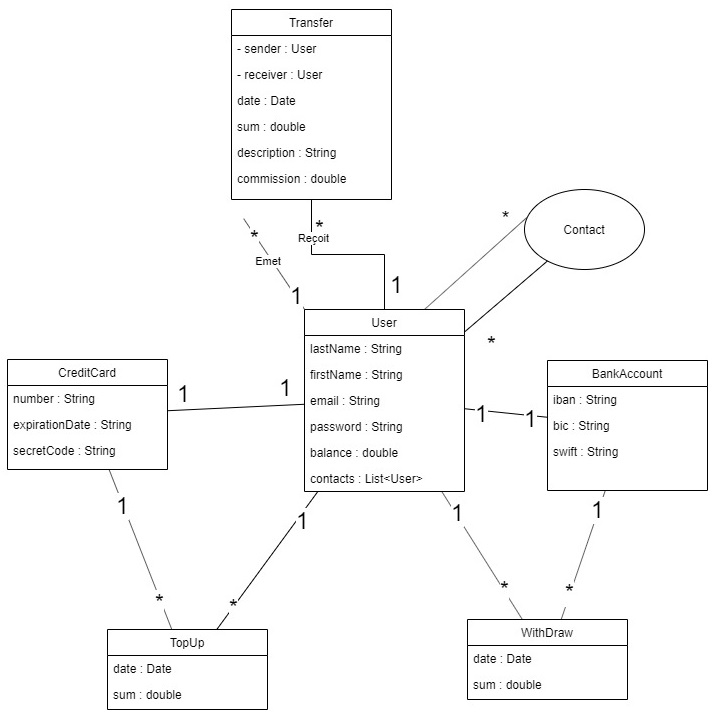
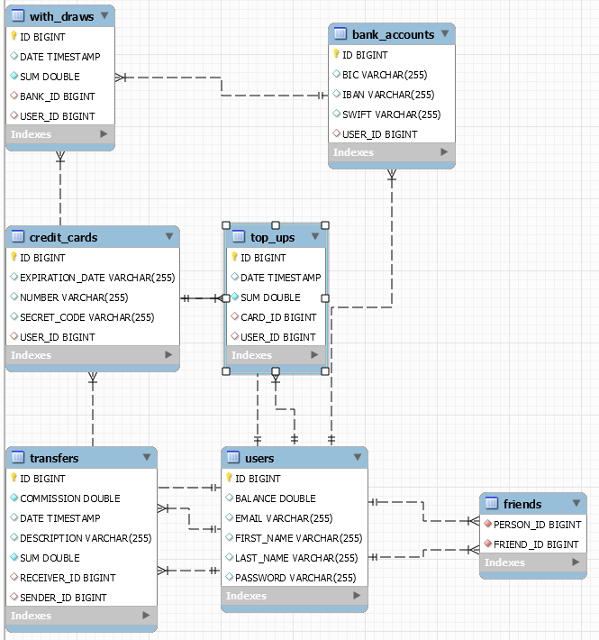

# Pay My Buddy

Pay My Buddy is a service that gives several features to a connected user : 
- Add friend
- Add a credit card 
- Add a bank account
- Send money to a friend (5% fees)
- TopUp User account from his credit card
- Withdraw User account to his bank account

## Database Schema (UML)






## Prerequisite to run it

- Java 1.8 JDK (or +)
- Maven 3.5.X (or +)
- Spring Boot 2.2.X (or +)

## Run app

```mvn
mvn clean install
mvn clean verify (generate tests and test report)
mvn site (generate reportings)
```

```Spring Boot
mvn spring-boot:run (run app)
mvn spring-boot:stop (stop app)
```

```Java (after compilation)
java -jar target/project6-0.0.1-SNAPSHOT.jar
```